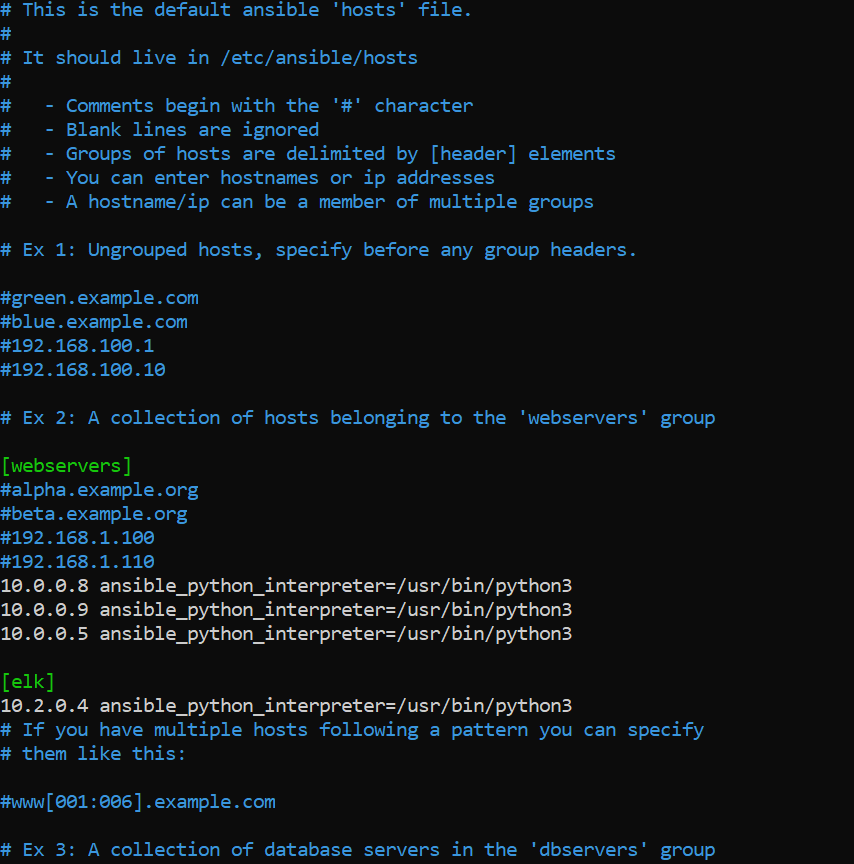
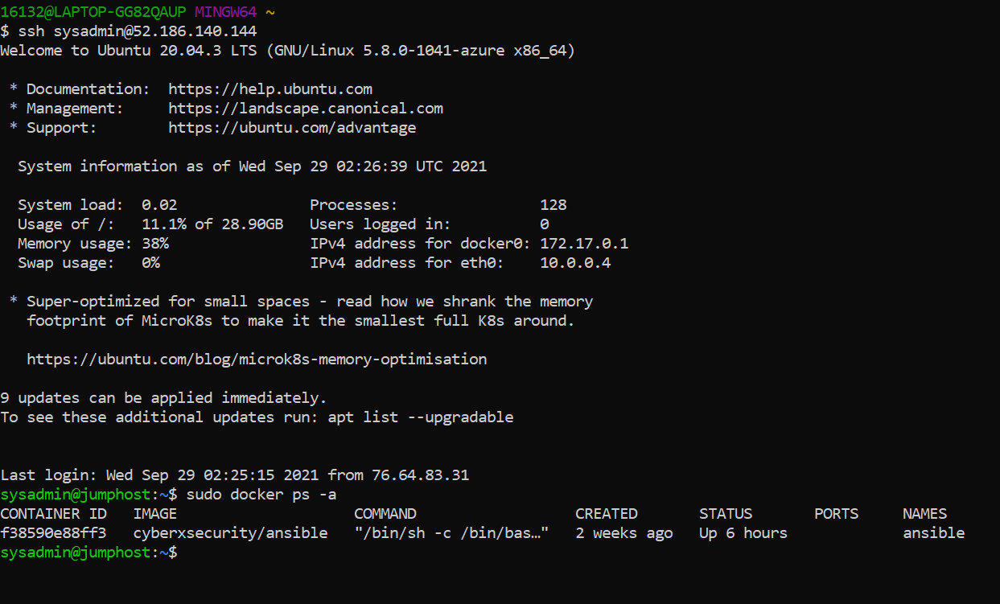

 ## Automated ELK Stack Deployment

The files in this repository were used to configure the network depicted below.

These files have been tested and used to generate a live ELK deployment on Azure. They can be used to either recreate the entire deployment pictured above. Alternatively, select portions of the __Ansible___ file may be used to install only certain pieces of it, such as Filebeat.

  - _TODO: Enter the playbook file._C:\Users\16132\Documents\Cybersecurity-Bootcamp\ELK Stack Files

This document contains the following details:
- Description of the TopologY
- Access Policies
- ELK Configuration
  - Beats in Use
  - Machines Being Monitored
- How to Use the Ansible Build

### Description of the Topology

The main purpose of this network is to expose a load-balanced and monitored instance of DVWA, the D*mn Vulnerable Web Application.

Load balancing ensures that the application will be highly __available___, in addition to restricting __access___ to the network.
- _TODO: What aspect of security do load balancers protect?_  Load Balancers protects the system from DDoS attacks by shifting attack traffic
- What is the advantage of a jump box?_Jumpbox serves to protect internal network by giving user access to a secure node to monitored

Integrating an ELK server allows users to easily monitor the vulnerable VMs for changes to the __Data___ and system _Logs____.
- _TODO: What does Filebeat watch for?  Filebeat monitors the log files or locations that you specify, collects log events, and forwards them either to Elasticsearch or Logstash for indexing_
- _TODO: What does Metricbeat record?_Metricbeat helps you monitor your servers by collecting metrics from the system and services running on the server

The configuration details of each machine may be found below.

| Name     | Function | IP Address | Operating System |
|----------|----------|------------|------------------|
| Jump Box | Gateway  | 10.0.0.4   | Linux            |
|   Web3   |     VM   | 10.0.0.8   | Linux            |
|   Web4   |     VM   | 10.0.0.9   | Linux            |
|   ELKWEB |     VM   | 10.2.0.4   | Linux            |

### Access Policies

The machines on the internal network are not exposed to the public Internet. 

Only the __Jumphost & ELKWEB___ machine can accept connections from the Internet. Access to this machine is only allowed from the following IP addresses:
- _TODO: Add whitelisted IP addresses _52.186.140.144 (JUMPHOST)
-                                      20.110.3.122 (ELKWEB)

Machines within the network can only be accessed by _Jumphost____.

- _TODO: Which machine did you allow to access your ELK VM? What was its IP address?_ELKWEB IP (10.2.0.4)

A summary of the access policies in place can be found in the table below.

| Name     | Publicly Accessible | Allowed IP Addresses |
|----------|---------------------|----------------------|
| Jump Box | Yes                 |  52.186.140.144      |
|          |                     |                      |
|          |                     |                      |

### Elk Configuration

Ansible was used to automate configuration of the ELK machine. No configuration was performed manually, which is advantageous because...
- _TODO: What is the main advantage of automating configuration with Ansible?_Ansible is fast and performs all functions over SSH and doesn't require agent installation. 

The playbook implements the following tasks:
- _TODO: In 3-5 bullets, explain the steps of the ELK installation play. E.g., install Docker; download image; etc._

- ..Using Ansible, configure the newly created VM.
-From your Ansible container, add the new VM to Ansible's hosts file.
-Create a playbook that installs Docker and configures the container.
-Run the playbook to launch the container..
-Add New VM to the list of machines Ansible can discover and connect to.

The following screenshot displays the result of running `docker ps` after successfully configuring the ELK instance.

### Target Machines & Beats
This ELK server is configured to monitor the following machines:
- _TODO: List the IP addresses of the machines you are monitoring_10.0.0.8 & 10.0.0.9

We have installed the following Beats on these machines:
- _TODO: Specify which Beats you successfully installed_ Filebeat and Metricbeat

These Beats allow us to collect the following information from each machine:
- _Filebeat: Filebeat monitors the log files or locations that you specify, collects log event.
  _Metricbeat: Helps monitor your servers by collecting metrics from the system and services running on the server.

### Using the Playbook
In order to use the playbook, you will need to have an Ansible control node already configured. Assuming you have such a control node provisioned: 

SSH into the control node and follow the steps below:
- Copy the _Config____ file to Gitbash_____.
- Update the ___Config__ file to include...remote username
- Run the playbook, and navigate to _VM___ to check that the installation worked as expected.

_TODO: Answer the following questions to fill in the blanks:_
- _Which file is the playbook?- YML File Where do you copy it?_On to Gitbash Terminal
- _Which file do you update to make Ansible run the playbook on a specific machine? Hosts file
- How do I specify which machine to install the ELK server on versus which to install Filebeat on?_Install ELK on Jumphost within Ansible hosts file
- _Which URL do you navigate to in order to check that the ELK server is running? http//20.110.3.122:5601/app/kibana

_